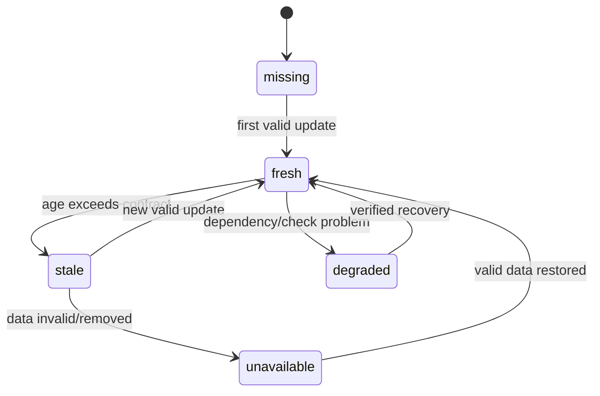
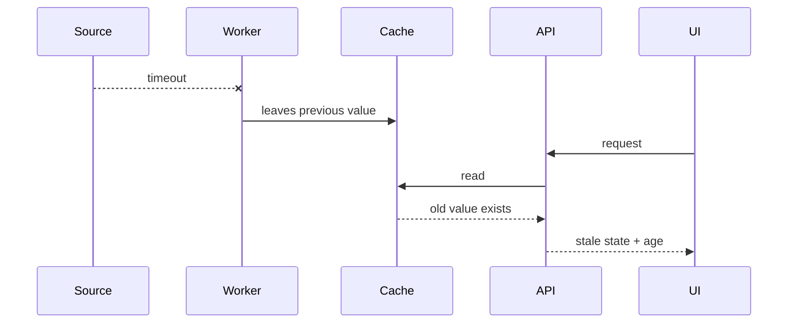

# Data freshness model

A key reliability lesson in BullSignal is that these states are different:

1. the endpoint answered;
2. data exists;
3. data is recent enough;
4. the frontend actually rendered it;
5. the user therefore sees a healthy current state.

Treating them as one boolean causes misleading green states.

## Freshness state machine

## Public model

| State | Meaning | User/system behaviour |
|---|---|---|
| `fresh` | usable and within age contract | normal display |
| `stale` | present but too old | warning/fail closed according to use case |
| `unavailable` | required data absent | explicit unavailable state |
| `degraded` | data may exist but reliability evidence is incomplete | do not present as fully healthy |

## What must be observable

For freshness-sensitive data, evidence should include:

- source/update timestamp;
- current age;
- freshness threshold or policy identifier;
- last successful collector/job execution;
- whether the dependency request itself succeeded;
- whether application validation succeeded;
- whether the frontend received/rendered the response when relevant.

## Failure example

The dangerous version of this flow is returning the old value as if it were current simply because the cache read succeeded.

## Design rule

**Availability is not freshness; freshness is not rendering health.** Each should have its own evidence and failure state.
