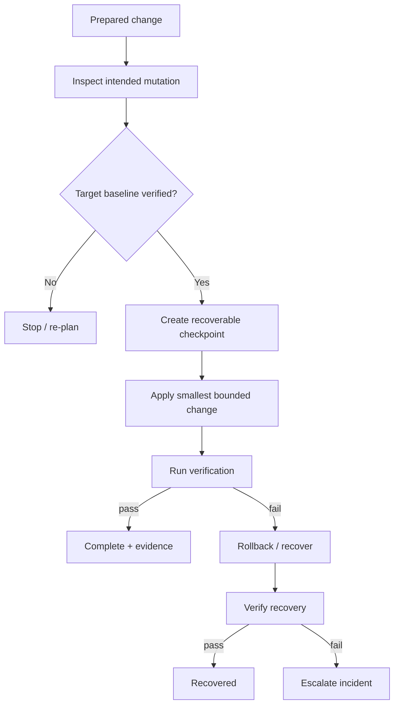

# Deployment safety model

The public architecture treats deployment as a controlled state transition.

## Workflow

## Preconditions

Before mutation:

- intended target and scope are known;
- expected baseline is verified;
- ambiguous drift stops the operation;
- recovery/checkpoint exists where the change is recoverable;
- verification criteria are defined before apply.

## Verification is behaviour-oriented

A successful file write, process exit code or HTTP `200` is useful evidence, but not sufficient when the feature has a richer user-visible contract.

Examples of stronger verification:

- endpoint returns the expected semantic state;
- background job produces current valid data;
- duplicate action no longer repeats a side effect;
- user-facing route renders the intended state;
- recovery restores the pre-change capability.

## Rollback rule

Rollback is not improvised after a failure. It is part of the design before mutation begins.

The recovery step itself must be verified. A rollback command returning success does not prove the system is healthy again.

## Why baseline matters

A patch may be valid against one snapshot and unsafe against another. Therefore the effective target state must be checked rather than assumed from an old development copy.

## Public boundary

Real deployment endpoints, providers, service names, filesystem paths, operator identities and backup artifacts are intentionally not included here.
