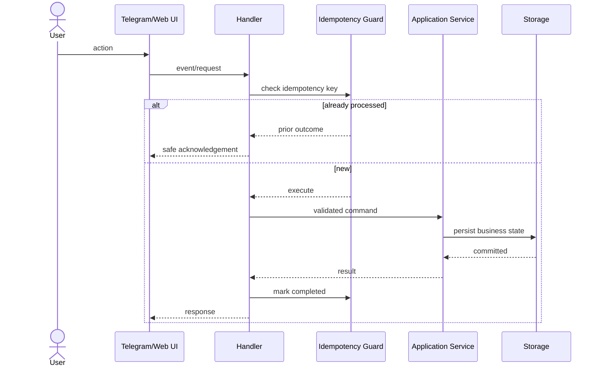
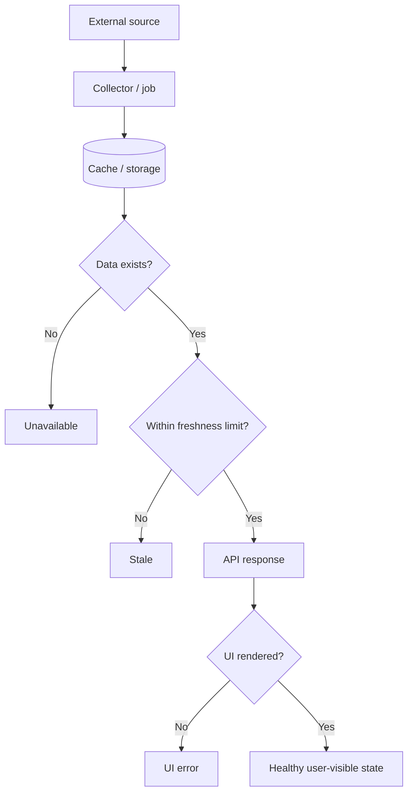
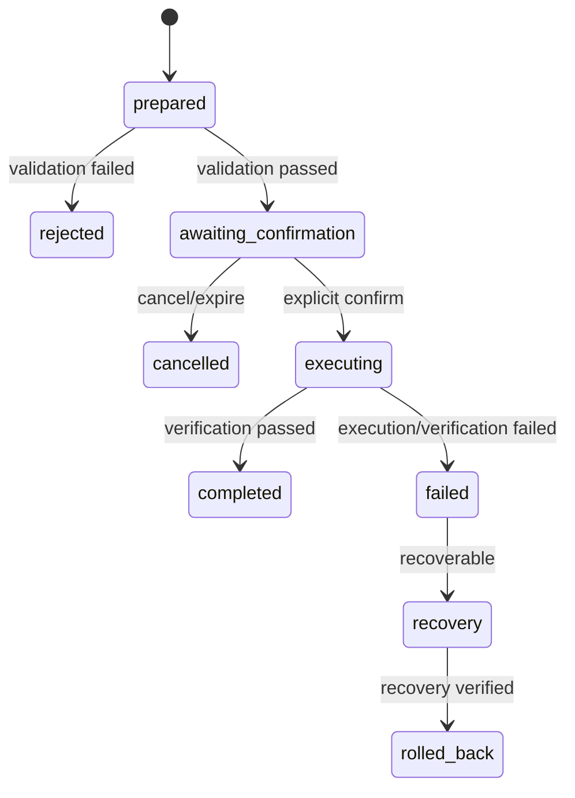
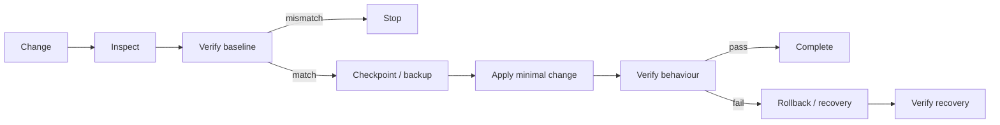
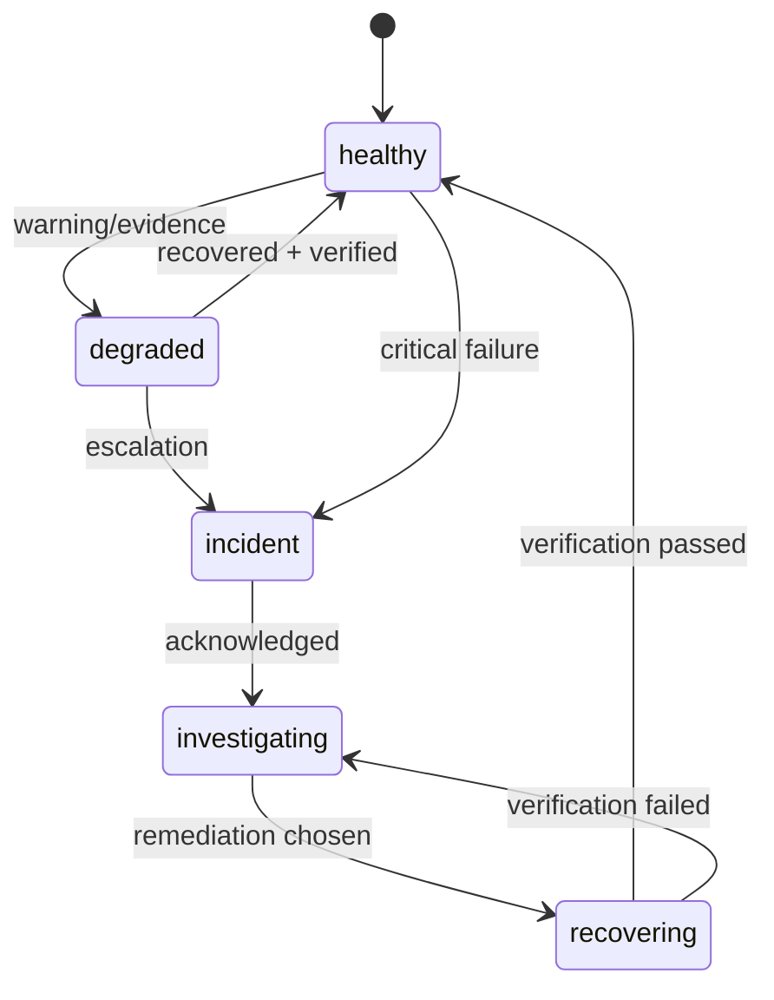
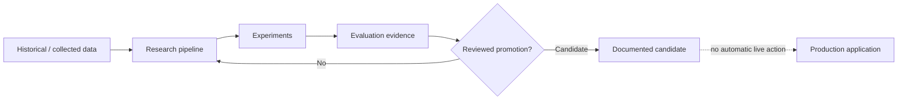
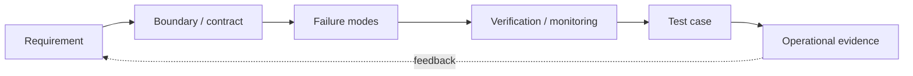

# Architecture and reliability diagrams

All diagrams are deliberately generic and omit production topology.

## 1. Duplicate-safe callback

## 2. Freshness contract

## 3. Confirmation-gated action

## 4. Deployment safety

## 5. Incident lifecycle

## 6. Research isolation

## 7. Reliability evidence chain

