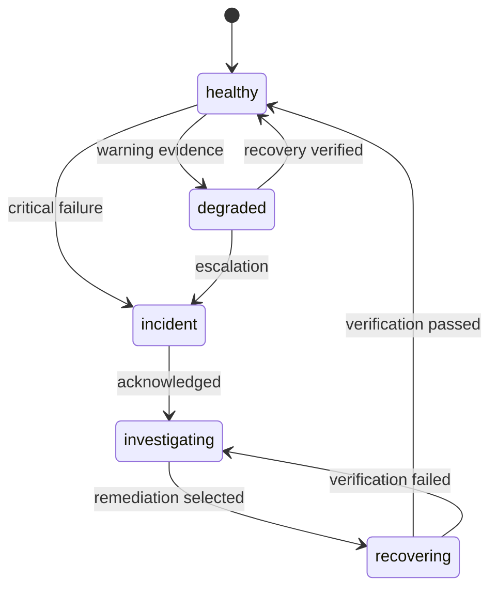

# Incident and health model

## Health states



## Evidence model

| Stage | Question to answer |
|---|---|
| Detection | What observable evidence changed? |
| Classification | Which capability/dependency is affected? |
| Impact | What user-visible or system behaviour is at risk? |
| Investigation | What hypotheses were checked? |
| Remediation | What bounded change/action was performed? |
| Verification | What proves intended behaviour is restored? |
| Closure | What evidence and follow-up remain? |

## Incident record — public conceptual shape

```json
{
  "incident_id": "incident-demo-001",
  "severity": "warning",
  "component": "background-data-flow",
  "state": "investigating",
  "detected_at": "2026-01-01T12:00:00Z",
  "evidence": [
    "freshness threshold exceeded",
    "last successful update older than contract"
  ]
}
```

## Closure rule

An incident is not considered resolved only because an error message disappeared. Closure requires evidence that the intended capability has recovered.

Examples:

- collector runs successfully **and** produces fresh valid data;
- API responds **and** reports a fresh state;
- deployment rollback completes **and** recovery checks pass;
- duplicate-delivery guard handles a repeated test event without repeating the business side effect.

## Alert quality

A useful alert should help answer:

- what broke or degraded;
- how confident the detector is;
- what evidence supports the state;
- whether the condition is user-visible;
- what verification is required before closure.

This avoids turning monitoring into a stream of unactionable warnings.
