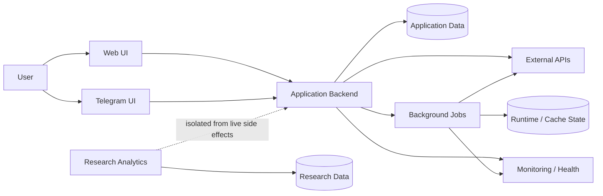
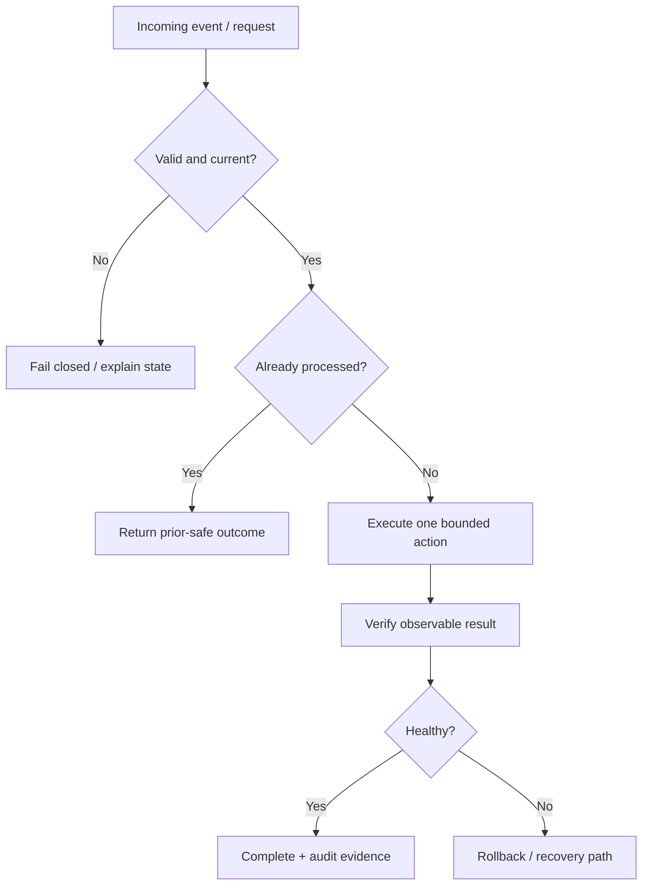

# BullSignal — system architecture & reliability case

**System analysis · Integration architecture · Reliability · Monitoring · Deployment safety**

BullSignal is a larger engineering project that combines web/backend flows, Telegram UX, external APIs, background processing, monitoring and isolated analytics research.

This public repository is a **sanitized architecture and reliability portfolio**. Production code, credentials, infrastructure topology, hostnames, private endpoints, datasets and trading rules remain private.

> Interviewer/recruiter: start with [`INTERVIEW_GUIDE.md`](INTERVIEW_GUIDE.md) for a 30-second, 2-minute and 5-minute walkthrough.

## System view

The diagram shows responsibilities and boundaries, not production placement.

## What this case demonstrates

- decomposition of a multi-component product;
- API/integration boundary analysis;
- idempotency and duplicate-delivery protection;
- data freshness contracts;
- background-job and cache reasoning;
- monitoring and incident state modelling;
- confirmation-gated side effects;
- deployment baseline verification and rollback;
- isolation of research from production actions;
- failure analysis and postmortem thinking;
- requirements / NFR / test traceability;
- public-safety and information-boundary discipline.

## Portfolio artifacts

| Artifact | What it shows |
|---|---|
| [`CASE_STUDY.md`](CASE_STUDY.md) | problem, scope and engineering context |
| [`SYSTEM_CONTEXT.md`](SYSTEM_CONTEXT.md) | actors, system boundaries and responsibilities |
| [`REQUIREMENTS.md`](REQUIREMENTS.md) | functional/NFR requirements and acceptance criteria |
| [`DIAGRAMS.md`](DIAGRAMS.md) | context, sequence, state and reliability diagrams |
| [`INTEGRATION_CONTRACTS.md`](INTEGRATION_CONTRACTS.md) | public-safe API/event contracts and error semantics |
| [`DATA_FRESHNESS.md`](DATA_FRESHNESS.md) | availability vs freshness vs rendering health |
| [`RELIABILITY_CASES.md`](RELIABILITY_CASES.md) | mini-postmortems: duplicates, stale data, deployed-state drift |
| [`INCIDENT_MODEL.md`](INCIDENT_MODEL.md) | health states, escalation and recovery verification |
| [`DEPLOYMENT_SAFETY.md`](DEPLOYMENT_SAFETY.md) | inspect → baseline → backup → apply → verify → rollback |
| [`RESEARCH_BOUNDARY.md`](RESEARCH_BOUNDARY.md) | separation of research from live side effects |
| [`TRACEABILITY.md`](TRACEABILITY.md) | requirement → design → verification evidence |
| [`INTERVIEW_GUIDE.md`](INTERVIEW_GUIDE.md) | concise technical walkthrough and likely questions |
| [`ROADMAP.md`](ROADMAP.md) | real next steps linked to Issues |

## Reliability principles

The central idea is simple: **a successful function call is not enough evidence that the system is healthy**.

## Live roadmap

- [Issue #1 — SLI/SLO catalogue](https://github.com/blsoo/bullsignal-system-architecture/issues/1)
- [Issue #2 — contract-level reliability tests](https://github.com/blsoo/bullsignal-system-architecture/issues/2)
- [Issue #3 — unified audit evidence model](https://github.com/blsoo/bullsignal-system-architecture/issues/3)

## Related flagship projects

- [DevWork — system analysis & workflow automation](https://github.com/blsoo/devwork-system-analysis)
- [BullADM — safe operational automation](https://github.com/blsoo/bulladm-ops-automation)

## Public-safety boundary

This repository intentionally contains no production credentials, real infrastructure layout, account identifiers, privileged endpoints, private datasets, operational secrets or proprietary trading rules. It is designed to demonstrate engineering reasoning without publishing access-sensitive implementation details.
