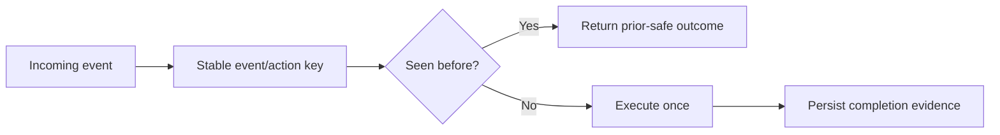
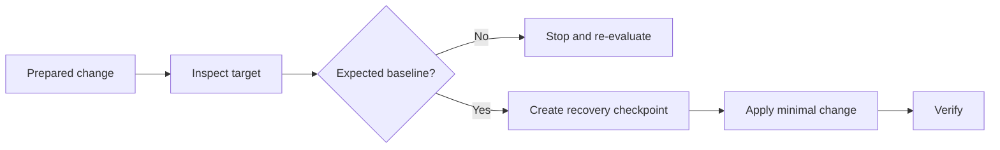

# Reliability mini-postmortems

These are public-safe engineering cases. They describe failure patterns and design responses without exposing production internals.

## Case 1 — duplicate user action

### Symptom
A user action could be handled more than once, producing duplicate messages or risking a repeated state change.

### Weak fix
Suppress one duplicate symptom in a specific handler.

### Better model
Treat the boundary as potentially **at-least-once delivery** and introduce operation identity/idempotency.

### Design response

### Verification
- same event key twice → one business side effect;
- duplicate acknowledgement remains deterministic;
- incomplete first attempt does not create an ambiguous second action.

### Lesson
Idempotency belongs at the integration/business-operation boundary, not only in UI code.

---

## Case 2 — stale data looked healthy

### Symptom
The UI could receive a successful response while the underlying cached data was old.

### Root design problem
Health had been implicitly reduced to **"request returned successfully"**.

### Design response
Separate:

- dependency availability;
- data existence;
- data freshness;
- API response success;
- frontend rendering state.

### Verification
- old data crosses the freshness threshold → explicit `stale` state;
- missing data → `unavailable`, not an empty healthy response;
- new collector update → freshness recovers only after validation.

### Lesson
A cache hit is not proof of current data.

---

## Case 3 — repository state vs deployed state drift

### Symptom
A change prepared against an old code/repository snapshot can be logically correct yet unsafe for the actually deployed baseline.

### Root design problem
The deployment plan assumes that the operator's snapshot is the source of truth.

### Design response

### Verification
- baseline mismatch blocks normal apply;
- backup/checkpoint exists before mutation;
- failure after apply leads to rollback/recovery verification.

### Lesson
The deployed state and its verified change history matter more than an old local baseline.

---

## Case 4 — monitoring showed a warning but not enough evidence

### Symptom
A single warning code may tell an operator **where** a problem is suspected but not whether the user-visible flow is actually broken or recovered.

### Design response
An incident should carry evidence across:

`detection → classification → investigation → remediation → verification → closure`

### Lesson
Closing an incident because an exception stopped appearing is weaker than closing it because the intended behaviour was re-verified.

---

## Common pattern

Across all four cases, the same principle appears:

> Do not infer state from one signal when the system can expose direct verification evidence.
