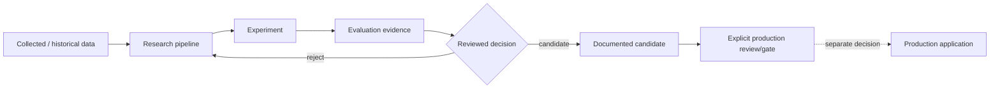

# Research / production boundary

BullSignal includes analytics research, but the public architecture treats research and production as separate trust/side-effect zones.

## Flow

## Rules

1. Research code may evaluate data but does not automatically create live side effects.
2. Experimental metrics are evidence, not authorization.
3. A research candidate must be reproducible enough to review before promotion.
4. Production safeguards are not bypassed because an experiment looks successful.
5. Research failures must not mutate production state.
6. Private datasets and proprietary decision rules are outside the public repository.

## Why this matters

Without an explicit boundary, exploratory code can gradually become an accidental production dependency. That creates hidden coupling, weak auditability and a risk that a change intended only for analysis changes live behaviour.

## Evaluation concerns

The public case emphasizes process rather than proprietary metrics:

- avoid future-information leakage;
- keep evaluation periods logically separated where appropriate;
- record experiment configuration/evidence;
- distinguish gross-looking metrics from net/realistic outcomes;
- do not tune the production system only to one convenient period;
- preserve a reviewed promotion step.

## Interview question

**Why not let the research model write directly into production if it performs well?**

Because model performance and authorization are different concerns. The live system has operational, risk, user and audit constraints that an experiment does not satisfy merely by producing a good metric.
