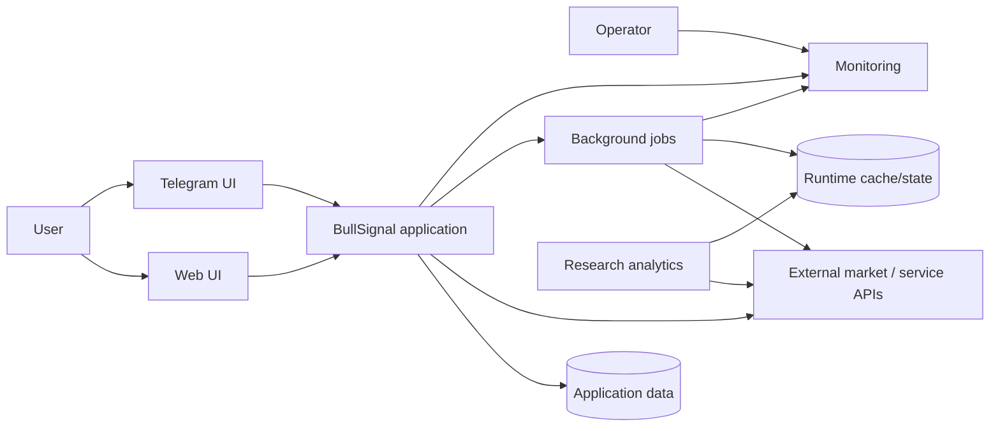

# System context

## Actors and external systems

## Responsibility boundaries

| Component | Responsibility | Must not own |
|---|---|---|
| Web / Telegram UI | user interaction and presentation | core business rules |
| Application backend | validation, orchestration, domain rules | UI-specific rendering logic |
| Background jobs | scheduled collection/processing | uncontrolled direct user interaction |
| Runtime cache | short-lived derived state | source-of-truth business identity |
| Monitoring | health evidence and incident state | silent production mutation |
| Research analytics | experiments and evaluation | automatic live activation |

## Important boundary decisions

### UI is an adapter

Telegram callbacks and web actions should call application services. Business rules should not exist only inside one UI handler.

### Cache is not health

The existence of a cache object does not prove it is current enough for user-visible use.

### Monitoring is evidence, not authority

Monitoring can identify degraded state and recommend remediation, but should not silently bypass confirmation/risk gates.

### Research is isolated

Research may read collected/historical data and produce evaluated candidates. Promotion into production is an explicit reviewed step.

## Trust assumptions

- external APIs may be slow, unavailable or return incomplete/stale data;
- events/callbacks may be retried or duplicated;
- background workers may miss a schedule window;
- deployed state can differ from a developer's local snapshot;
- a successful HTTP response does not prove the UI displays current information.
